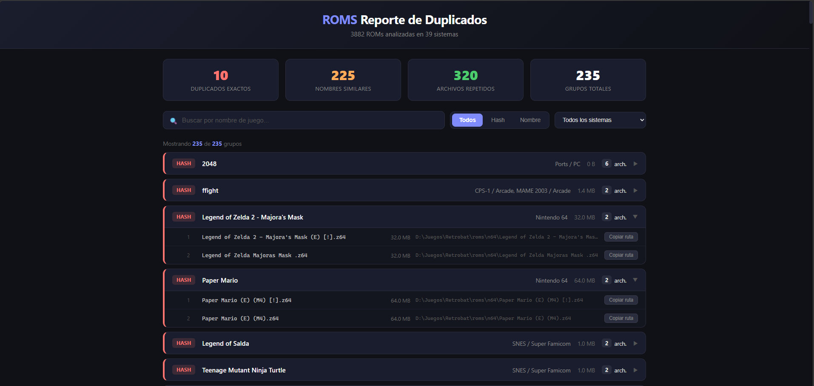

# Duplicate ROM Detector

Herramienta en Python para detectar juegos duplicados en colecciones de ROMs con estructura tipo RetroArch / RetroBat. Genera dos reportes HTML interactivos: uno para revisar duplicados y otro para ver el inventario completo por sistema.




---

## Tabla de contenidos

- [Requisitos](#requisitos)
- [Descargar / Clonar](#descargar--clonar)
- [Modo de uso](#modo-de-uso)
- [Que se genera](#que-se-genera)
- [Que detecta](#que-detecta)
- [Estructura del proyecto](#estructura-del-proyecto)
- [Configuracion](#configuracion)
- [Funcionamiento interno](#funcionamiento-interno)
- [Compatibilidad](#compatibilidad)

---

## Requisitos

- **Python 3.6** o superior
- **No requiere dependencias externas** — usa unicamente la libreria estandar de Python (`os`, `hashlib`, `difflib`, `threading`, `html`, `collections`, `re`, `json`, `itertools`, `time`, `sys`)
- Compatible con **Windows**, **Linux** y **macOS**

> **Tip Windows:** Durante la instalacion de Python, marca la opcion **"Add Python to PATH"** para que el archivo `.bat` funcione correctamente.

---

## Descargar / Clonar

### Opcion 1: Clonar con Git

```bash
git clone https://github.com/matias-ramirez705/Duplicate-ROM-detector.git
cd Duplicate-ROM-detector
```

### Opcion 2: Descargar ZIP

1. Ir a [github.com/matias-ramirez705/Duplicate-ROM-detector](https://github.com/matias-ramirez705/Duplicate-ROM-detector)
2. Clic en el boton verde **"Code"**
3. Seleccionar **"Download ZIP"**
4. Descomprimir en la carpeta que prefieras

### Opcion 3: Solo los archivos necesarios

No necesitas clonar todo el repo. Con copiar estos archivos alcanza:

```
Duplicate-ROM-detector/
  main.py
  config.py
  scanner.py
  utils.py
  reporter_html.py
  reporter_inventory.py
  run.bat          (solo Windows)
```

---

## Modo de uso

### Windows (recomendado)

1. Haz **doble clic** en `run.bat`
2. Te pedira la ruta de tu carpeta de ROMs (puedes arrastrar la carpeta con el mouse)
3. Espera a que termine el analisis
4. Abre los archivos HTML generados en tu navegador

### Desde la terminal / consola

```bash
# Usar el .bat (Windows)
run.bat

# O ejecutar directamente con Python
python main.py "C:\Ruta\A\Tus\Roms"

# Linux / macOS
python3 main.py "/home/usuario/roms"
```

### Estructura esperada de la carpeta de ROMs

El script espera una carpeta raiz con subcarpetas por sistema, asi:

```
Roms_R36S/
  nes/
    Super Mario Bros (USA).nes
    Zelda - The Legend of Zelda (USA).nes
  snes/
    Super Mario World (USA).sfc
    Super Mario World (Japan).sfc
    Super Mario World (Europe).sfc
  gba/
    Pokemon - Ruby Version (USA).gba
    Pokemon - Sapphire Version (USA).gba
  ports/
    Grand Theft Auto San Andreas.sh
    2048.libretro
  ...
```

Cada subcarpeta representa un sistema/emulador, y los archivos dentro son las ROMs o juegos.

---

## Que se genera

El proceso genera **dos archivos HTML** en la misma carpeta donde esta `main.py`:

### 1. `reporte_duplicados.html` — Reporte de duplicados

Muestra todos los grupos de archivos duplicados encontrados, con:

- **Estadisticas:** cantidad de duplicados exactos, por nombre similar, y archivos eliminables
- **Filtros:** buscar por texto, filtrar por tipo (Hash / Nombre) y por sistema
- **Grupos expandibles:** cada grupo se puede abrir para ver todos los archivos que lo componen
- **Boton "Copiar ruta":** copia la ruta completa de cualquier archivo al portapapeles
- **Atajos de teclado:** `Ctrl+F` para buscar, `Escape` para limpiar

Los grupos se marcan con colores:
- **Rojo** (borde izquierdo) = Duplicado exacto por hash
- **Naranja** (borde izquierdo) = Nombre similar (posible duplicado)


### 2. `inventario_roms.html` — Inventario completo

Lista **TODAS** las ROMs organizadas por sistema, con:

- **Estadisticas:** total de ROMs, cantidad de sistemas, tamano total de la coleccion
- **Secciones colapsables:** cada sistema es una seccion que se abre/cierra
- **Busqueda:** busca dentro de cualquier sistema o nombre de archivo
- **Filtro por sistema:** dropdown para ver solo un sistema especifico
- **Boton "Expandir todos":** abre todas las secciones a la vez
- **Tamano por sistema:** muestra la cantidad de ROMs y el tamano total de cada uno


Ambos archivos HTML son **auto-contenidos** (no necesitan servidor ni conexion a internet). Simplemente abrilos en Chrome, Edge o Firefox.

---

## Que detecta

### Duplicados exactos (Hash MD5)

Compara el contenido real de cada archivo usando hash MD5. Si dos archivos tienen el mismo hash, son **byte por byte identicos** — puedes borrar todos menos uno sin perder nada.

> Nota: Los archivos `.libretro`, `.sh`, `.desktop` y `.py` no se les calcula hash porque son archivos de configuracion que comparten plantillas entre juegos distintos (ver [Extensiones sin hash](#extensiones-sin-hash)).

### Duplicados por nombre similar (Fuzzy Matching)

Compara los nombres de los archivos despues de limpiarles los tags comunes:

- Tags de region: `(USA)`, `(Japan)`, `(E)`, `(J)`, `(Europe)`
- Tags de idioma: `(En)`, `(Spain)`, `(T+Spa)`
- Tags de codigo: `[!]`, `[b]`, `[h1C]`, `[T+Eng]`
- Revisiones: `Rev A`, `v1.0`, `v1.1`

Usa `difflib.SequenceMatcher` (stdlib) con un umbral configurable (default: 85%). Si la similitud supera el umbral, los agrupa como posibles duplicados. Emplea un algoritmo **Union-Find** para agrupar transitivamente: si A es similar a B, y B es similar a C, entonces {A, B, C} forman un solo grupo.

---

## Estructura del proyecto

```
Duplicate-ROM-detector/
├── main.py                # Punto de entrada. Orquesta los 4 pasos del proceso.
├── config.py              # Toda la configuracion editable por el usuario.
├── scanner.py             # Escaneo de archivos y deteccion de duplicados.
├── utils.py               # Funciones auxiliares (hash, limpieza de nombres, etc.).
├── reporter_html.py       # Genera el HTML de duplicados.
├── reporter_inventory.py  # Genera el HTML del inventario completo.
├── reporter.py            # Generador CSV (legado, ya no se usa por defecto).
├── run.bat                # Ejecutable para Windows (doble clic).
├── README.md              # Este archivo.
└── imagen/
    ├── Duplicados.png         # Captura del reporte de duplicados.
    └── Lista completa.png     # Captura del inventario completo.
```

### Que hace cada archivo

| Archivo | Descripcion |
|---|---|
| `main.py` | Punto de entrada del programa. Muestra el banner, recibe la ruta (via argumento o config.py), ejecuta los 4 pasos (escanear, detectar hash, detectar nombres, generar HTMLs) con animacion de spinner entre cada paso. |
| `config.py` | Toda la configuracion en un solo lugar: ruta base, extensiones validas, umbral de similitud, carpetas excluidas, mapa de nombres de sistemas, patrones de limpieza, etc. |
| `scanner.py` | Contiene la logica principal: `escanear_roms()` recorre todas las subcarpetas y construye la lista de ROMs; `detectar_duplicados_hash()` agrupa por MD5; `detectar_duplicados_nombre()` compara nombres con fuzzy matching en dos fases; `_agrupar_pares()` usa Union-Find para agrupar transitivamente. |
| `utils.py` | Funciones auxiliares: `calcular_hash_md5()` (lectura por bloques de 8KB), `limpiar_nombre()` y `generar_nombre_sugerido()` (quitan tags con regex), `formatear_tamano()` (bytes a KB/MB/GB), `obtener_nombre_sistema()` (busca en el mapa de config.py). |
| `reporter_html.py` | Genera `reporte_duplicados.html`. Python construye todo el HTML (tarjetas, filas, atributos `data-*`) y JavaScript solo maneja filtros via `display:none/""`. Sin template literals para evitar errores con caracteres especiales. |
| `reporter_inventory.py` | Genera `inventario_roms.html`. Misma filosofia: Python genera todo el HTML con secciones colapsables por sistema, busqueda profunda dentro de filas, y filtro por sistema. |
| `run.bat` | Ejecutable Windows con `chcp 65001` (UTF-8). Verifica que Python este instalado, pide la ruta al usuario (permite arrastrar carpeta con el mouse), valida que exista, y ejecuta `main.py` pasando la ruta. |
| `reporter.py` | Generador CSV original (legado). Ya no se usa por defecto pero se conserva por compatibilidad. |

---

## Configuracion

Todas las opciones se editan en `config.py`. No necesitas tocar ningun otro archivo.

### Opciones principales

| Opcion | Default | Descripcion |
|---|---|---|
| `RUTA_BASE` | `r"C:\Roms_R36S"` | Carpeta raiz con las subcarpetas de sistema |
| `CALCULAR_HASH` | `True` | Calcular MD5 para duplicados exactos. `False` es mas rapido |
| `UMBRAL_SIMILITUD` | `85` | Sensibilidad de deteccion por nombre (0-100) |
| `LIMITE_TAMANIO_HASH_MB` | `100` | Archivos mas grandes se saltan el hash |

### Extensiones

| Opcion | Descripcion |
|---|---|
| `EXTENSIONES_VALIDAS` | Lista de extensiones a procesar (39 extensiones: ROMs de consolas, CD, comprimidas, ports) |
| `EXTENSIONES_SIN_HASH` | Extensiones donde NO se calcula hash (`.libretro`, `.sh`, `.desktop`, `.py`) |

### Extensiones sin hash

Los archivos `.libretro` son configs que comparten la misma plantilla para todos los ports — entonces `2048.libretro` y `anarch.libretro` tienen el mismo hash pero son juegos completamente distintos. Para evitar estos falsos positivos, las siguientes extensiones **no se les calcula hash** pero siguen participando en la deteccion por nombre similar:

- `.libretro` — Config de core libretro
- `.sh` — Scripts de lanzamiento
- `.desktop` — Entradas de escritorio Linux
- `.py` — Scripts Python

### Carpetas excluidas

`EXCLUIR_CARPETAS` contiene carpetas que se omiten completamente: `saves`, `save_states`, `bios`, `thumbnails`, `images`, `configs`, `system`, etc.

### Mapa de sistemas

`MAPA_SISTEMAS` mapea nombres de carpeta de RetroBat/RetroArch a nombres legibles. Incluye ~250 sistemas: Nintendo, Sega, PlayStation, Xbox, Neo Geo, Arcade (MAME, FBNeo, CPS, Naomi...), computadoras (Amiga, C64, MSX, PC-98, DOS...), ports y engines (ScummVM, DOOM, Quake, GZDoom...). Si una carpeta no esta en el mapa, se muestra con su nombre original.

---

## Funcionamiento interno

El proceso se ejecuta en 4 pasos:

```
[1/4] Escaneando archivos de ROM...
      └─ Recorre cada subcarpeta, lee archivos, calcula hash MD5,
         genera nombre sugerido limpio.

[2/4] Detectando duplicados...
      ├─ Fase 1: Agrupa por hash MD5 → duplicados exactos
      └─ Fase 2: Compara nombres similares (SequenceMatcher)
         ├─ Dentro de cada carpeta (no cruza sistemas)
         ├─ Excluye archivos ya marcados por hash
         ├─ Cruza con grupos de hash (para atrapar variantes tipo "Rev 1")
         └─ Agrupa pares con Union-Find (A~B + B~C → {A,B,C})

[3/4] Generando reporte de duplicados HTML...
      └─ Crea reporte_duplicados.html con grupos, filtros y estadisticas.

[4/4] Generando inventario completo...
      └─ Crea inventario_roms.html con todas las ROMs por sistema.
```

### Limpieza de nombres

Antes de comparar nombres, se aplican 5 patrones regex secuenciales:

1. Quita tags entre parentesis: `(USA)`, `(Japan)`, `(Rev A)`
2. Quita tags entre corchetes: `[!]`, `[h1C]`, `[T+Eng]`
3. Quita tags entre llaves: `{h}`
4. Quita codigos de revision: `Rev A`, `v1.0`, `v1.1`
5. Compacta espacios multiples

Ejemplo: `Super Mario World (USA) [!].sfc` → `Super Mario World`

---

## Compatibilidad

Funciona con cualquier carpeta que tenga la estructura de RetroArch/RetroBat, no solo R36S. Probado con:

- **R36S** (handheld retro)
- **RetroBat** (Windows)
- **RetroArch** (multiplataforma)
- **Batocera** (Linux)
- Cualquier carpeta con subcarpetas por sistema y archivos ROM dentro
